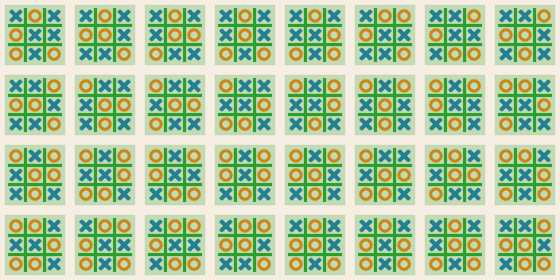

# Watch Reinforcement Learning algorithms figure out Tic-Tac-Toe faster than you did!

The game Tic-Tac-Toe is complex enough for many different strategies to be applied, yet simple enough that the entire space of gameplay is enumerable.   From player X's perspective, there are only about 500,000 possible games (a sequence of between 6 and 10 states) that can be played, and they will be played with fewer than 9,000 distinct game board states.  This makes it a good example for watching RL algorithms at work.  

### "Model-based" RL algorithms:

The so-called model-based methods take advantage of this beforehand knowledge of their environments.   In addition to the (usually trivial) initial states, *before* any learning the following are available to them:
*  every possible state (for Tic-Tac-Toe, all possible patterns of X, O, or blank spaces reachable from the empty board through valid moves), 
*  for every non-terminal state $s$:
    * the actions possible from that state: $\text{actions}(s) \in [a_0, ...]$ (the set of free spaces),
    * the resulting state $s'$ from taking action $a$ in state $s$: $\text{move}(s,a)=s'$ (a new game board with 1 more mark made), and
*  every state's terminal or non-terminal status:  $\text{term}(s)\in[\text{win-X},\text{win-O},\text{draw},- ]$.

The **value function** $v_\pi(s)$ is defined as the total (potentially discounted) reward we can expect if we are in state $s$ and following policy $\pi$ from that point forward. [ADD EQN, ADD def of $\pi$, move to DEFs?]

#### 1) Optimally estimating the value function $v_\pi(s)$ of policy $\pi(a,s)$:

Model based algorithms for learning $v(s)$ have access to the game mechanics described above.  These include:
* **Dynamic Programming** (DP):   
    * Set the value of terminal states directly.
    * Compute values for neighboring states (parents) directly by following the state-transition graph and applying the Bellman equation.
* **Iterative Policy Evaluation**:  
    * Set an initial  value function $v_0(s)$ to be zero for all but the terminal states.
    * Iteratively update $v_{t}()$ by evaluating policy $\pi$ at every state $s$, returning action(s) $a$ and following states $\{\text{move}(s,a) \}$ and use the Bellman equation to set $v_{t+1}(s)$. [FIXME]
#### 2) Estimating an optimal policy $\pi_1$ for value function $v_\pi(s)$

After we're confident our value function $v_\pi$ accurately estimates what total reward we can expect following $\pi$, can we learn a new policy, $\pi_1$ that is expected to perform better under the same value function?   In general, setting the new policy $\pi_1$ to recommend actions leading to higher-valued states than what $\pi$ recommends is called **Policy Improvement**.  

In the simple case that we want our policy to always take the best action, i.e. the action leading to the state with highest value, we have:

$$
\begin{equation}
\pi_1(s) = \underset  {a \in \text{actions(s)}} {argmax} \underset  {s' \in \text{move}(s,a)} Ev_{\pi}(s')
\end{equation}
$$

The original policy $\pi$ came with no guarantees, so $\pi_1$ might be different. We will always expect higher total reward from following policy $\pi_1$ over $\pi$ if, for every state $s$,  $\pi_1$ recommends an action leading to a state of greater or equal value than what $\pi$ recomends (from the *policy imporovment theorem* [proof?]).
#### 3) Alternating between 1) and 2)

With a new policy $\pi_1$ to follow, the old value function will no longer calculate our expected reward, so we can learn another value fuction $v_{\pi_1}$ from one of the algorithms in section 1.  Iterating this process by alternating between the Policy Evaluation ($\underset E \to$) and Policy Improvement ($\underset I \to$),

$$
\begin{equation}
\pi_0 \underset E \to v_\pi \underset I \to \pi_1 \underset E \to v_{\pi_1} \underset I \to \pi_2 \underset E \to ...\text{ ,}
\end{equation}
$$

until $\pi_i$ converges is **Policy Iteration**.  The Tic-Tac-Toe demo of PI starts with $\pi_0$ as a hard-coded, heuristic algorithm and measures their improvement after each iteration.   

Note:  If we use the simple, optimal policy improvement step of section 2 for $\underset I \to$, this is known as **Value Iteration**.  

### "Model-free" algorithms

Suppose we don't have access to full set of possible game states before we do any learning and have to collect them as we play the game.

For games even slightly more complex than Tic-Tac-Toe, this will likely be the case.  We can determine whether a given state is terminal, but don't have the transition function $\text{move}$ ahead of time and therefore cannot learn a value function from a using one of the methods above.  We have to account for new states as they appear.

#### 4) Monte-carlo 

Initialize with a set of initial states & terminal states (with values set to the reward at that state), then until converged:
* Run many episodes of interaction (games of Tic-Tac-Toe). For each one, record: 
    * the sequence of states and actions,
    * the reward at the end.

* Update the values of $v(s)$ using the Bellman update rule [ADD EQN & PSEUDOCODE]

#### ***COMING SOON:***

#### 5) Q-learning

In-place, stochastic value iteration.

#### 6) Policy gradients
##### 6.5?
#### 7) Proximal Policy Optimization (PPO)

#### 8) Group Level Policy Optimization (GLPO)

# Watch RL algorithms learn Tic-Tac-Toe:

### Generating the Game Tree
The model-based algorithms rely on the full game tree, which can take several seconds to generate.   To save time, the demos will attempt to load a pre-generated tree from the file `game_tree_X.pkl`.  If they don't find it, they will generate it (~ 50 MB).   

Alternatively, to watch it generate with more verbosity, run:
```
ml_demos\rl> python tic_tac_toe.py
```
This will generate all the possible games player X could see, save the results, and then print out their statistics:
```
==========================================================
Saving game tree to cache file:  game_tree_X.pkl
        saved game tree to cache file:  game_tree_X.pkl
==========================================================
Total unique states:  8533
        terminal, X-wins:  942
        terminal, O-wins:  942
        terminal, draw:  32
==========================================================
Games played: 510336

        X goes first:
                X wins: 131184
                O wins: 77904
                Draws: 46080

        O goes first:
                X wins: 77904
                O wins: 131184
                Draws: 46080

        Totals:
                X wins:  209088
                O wins:  209088
                Draws: 92160

Creating Draw States image...
        saved to:  draw_states.png
```
As well as displaying all 32 draw states in the image:



(lines are green, indicating a draw terminal state.)


### The Game Tree App:

This app shows all 8,533 game states in the same window and all edges between them.  Click states to show their parents/children up to a given depth.  Control with the following **hotkeys**:
  
* `[` - decrease  parent depth (Number of generates above selected state)
* `]` - increase parent depth
* `;` - decrease child depth
* `'` - incrase child depth
* `q` or `ESC` - quit

Start the app by runing: 
```
ml_demos\rl> python game_graph.py
```
[Note, this runs fullscreen at 1920x1080.  Changing the variable `'win_size'` at the top of the script will change the resolution but making it too much smaller may cause some states to overlap.]  This will show all reachable game board configurations aranged in 10 rows according to the number of moves made so far.   


(Smaller states show just colored dots, orange for X and blue for O.)

This shows a portion of the window near the bottom, with states after 7, 8, or 9 moves have been made.  Terminal states ares shaded according to the winner's color or green for draws.  The selected state shows four orange (x) and three blue (o) moves have been made, so the only children states have blue edges and there are two open spaces so there are two edges.   The only terminal states that are children of the selected state are draws and orange wins, so if blue is in that state, the best result they can expect will be a draw and they can force either endgame with their next move.   (Blue lines are drawn from the middle row (8 moves) because those are valid move for other games in which blue went first and can make the 9th move.  This graph shows all moves from all states irrespective of which player goes first, so not all edges will be valid for a given game.)

---COMPLETED WORK ABOVE HERE, FUTURE WORK PAST HERE---

## The RL Demo apps:

Each of the reinforcement learning demos shows the progress of an agent learning as the demo's particular algorithm is applied.  They all have the same general steps:
1. Pick a baseline policy.  For the policy improvement demos (value function estimation), they will be improving on this.  For the "model free" demos, this will be competing against the RL agent as it learns.
2. Run the RL algorithm (step through at various speeds), watch the value function change and the consequences to the agent's strategy.


    #### Baseline policies:
    1. `Random` player
    2. `Heuristic(n)` player, using rules 0 through n and/or defaulting to random (i.e. `Heuristic(0)` is equivalent to `Random`):

        1. If there is a winning move, take it.
        2. If the opponent has a winning move, block it.
        3. If the center is open, take it.
        4. If the opponent is in a corner, take the opposite corner.
        5. Take any open corner.

        If no rules apply, take any open space at random.

    3. `Perfect` player.  (???)


#### Main window:
1. **Value function**:  shows $V_t(s)$, the current value function for all states $s$.  States are arranged with an embedding like the game tree, represented by a small box in a color indicating the relative value.
2.  **Value updates**: shows  $\Delta V_t(s)$, the current (most recent, etc.) updates to the value function,   These are the changes made to each value for the next iteration, $V_{t+1}(s) = V_{t}(s) + \Delta V_t(s)$.
3. **Competition window**:  In a separate process, Tic-Tac-Toe games are running continually w/the best RL agent so far vs the baseline agent (and possibly others).  This window shows the win/loss rate(s) changing as the agent learns.

4. **Control area**: Run the algorithm at various speeds:
    * Step through each individual $v(s)$ update.
    * Step through each pass through the set of states $S$.
    * Step through each iteration of PI (pause after $V_{t+1}(s)$ converges after many passes through the set of states).
    * Run continually.

#### Strategy window shows:
A reinforcement learning agent that uses a value function and equation (1) to define its policy will "change its mind" about what to do in a certain state when the relative values of that state's children change such that there is a new highest-value child state.   After every PI iteration or N steps (etc), the number of "strategy changes" is counted and random examples are plotted showing the old and new preferred child state, and the number/kind of distinct terminal states under both child states.

### Demos:       

#### Dynamic Programming + Policy Improvement

#### Policy Evaluation  + Policy Improvement

#### Monte Carlo